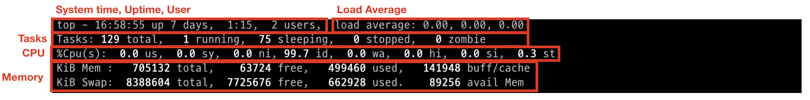

# OPENSOURCE 과제

1. TOP

2. PS

3. JOBS

4. KILL
 

## **TOP**
리눅스에서 실시간으로 시스템의 성능 상태를 모니터링하는 명령어로 CPU 사용률, 메모리 사용량, 프로세스 정보 등을 확인할 수 있다. 

top 명령어는 다양한 옵션과 키 입력을 통해 상세한 정보를 제공하고, 사용자 정의가 가능하다.

- ### header 부분

1. **시스템 시간, 업타임, 사용자 수:**
   현재 시스템 시간이 표시되고, 시스템이 얼마나 가동되었는지와 현재 로그인한 사용자 수가 표시된다.

2. **로드 평균:**
   지난 1분, 5분, 15분 동안의 시스템 평균 부하를 보여준다.

3. **태스크:**
   현재 실행 중인 프로세스, 대기 중인 프로세스, 중지된 프로세스, 좀비 프로세스의 수를 표시한다.

4. **CPU 사용률:**
   사용자 모드, 시스템 모드, 낮은 우선순위로 실행 중인 프로세스, 유휴 상태 등으로 나눠서 CPU 사용률을 보여준다.

5. **메모리 사용량:**
   총 메모리, 사용 중인 메모리, 사용 가능한 메모리, 캐시된 메모리를 보여줍니다.
   
6. **스왑 메모리 사용:**
   총 스왑 메모리, 사용 중인 스왑 메모리, 사용 가능한 스왑 메모리, 캐시된 스왑 메모리를 보여준다.

* ### tasks 부분
**1. PID:** 프로세스 ID.

**2. USER: 프로세스를 실행한 사용자.**

**3. PR:** 프로세스의 우선순위.

**4. NI:** 프로세스의 nice 값.

**5. VIRT:** 가상 메모리 사용량.

**6. RES:** 실제 메모리 사용량.

**7. SHR:** 공유 메모리 사용량.

**8. S:** 프로세스의 상태 (R: 실행 중, S: 대기, D: 중단되지 않는 대기, Z: 좀비, T: 중지).

**9. %CPU:** CPU 사용률.

**10. %MEM:** 메모리 사용률.

**11. TIME+:** 프로세스가 사용한 총 CPU 시간.

**12. COMMAND:** 실행된 명령어.

- ### 주요 단축키
1. h: 도움말.
2. k: 특정 프로세스를 종료 (PID 입력 필요).
3. r: 프로세스의 우선순위를 변경 (PID 입력 필요).
4. q: top 종료.
5. z: 색상 켜기/끄기.
6. Shift + p: CPU 사용률 기준 정렬.
7. Shift + m: 메모리 사용률 기준 정렬.
8. Shift + t: 실행 시간 기준 정렬.

- ### 주요 옵션
1. -d <시간>: 갱신 주기를 설정 (기본값은 3초).
2. -p <PID>: 특정 PID의 프로세스 정보만 표시.
3. -n <횟수>: 갱신 횟수를 설정한 후 자동 종료.

* * *
* * *

## **PS**

ps 명령어는 리눅스에서 현재 실행 중인 프로세스의 정보를 확인하는 데 사용된다. 

ps는 실시간 업데이트가 필요 없는 경우에 유용하며, 다양한 옵션을 통해 원하는 프로세스 정보를 필터링하고 형식을 지정할 수 있다. 

기본적으로 ps 명령어를 실행하면 현재 셸과 관련된 프로세스만 보여준다.

- ### 주요 옵션
1. a: 터미널에 종속되지 않은 모든 프로세스를 출력함.
2. u: 사용자 중심 형식으로 출력함.
3. x: 터미널에 연결되지 않은 모든 프로세스를 출력함.
4. -e: 모든 프로세스를 출력함.
5. -f: 완전한 형식으로 출력함(풀 포맷).

- ### 주요 필드
1. PID: 프로세스 ID.
2. TTY: 프로세스가 연결된 터미널.
3. TIME: 프로세스가 소비한 총 CPU 시간.
4. CMD: 실행된 명령어.
5. USER: 프로세스를 실행한 사용자.
6. %CPU: CPU 사용률.
7. %MEM: 메모리 사용률.
8. VSZ: 가상 메모리 사용량.
9. RSS: 실제 메모리 사용량.
10. START: 프로세스가 시작된 시간 또는 날짜.
11. STAT: 프로세스 상태 (R: 실행 중, S: 대기, D: 중단되지 않는 대기, Z: 좀비, T: 중지, W: 페이징, X: 종료).

* * *
* * *

## **JOBS**
jobs 명령어는 셸에서 실행 중인 백그라운드 및 포그라운드 작업의 목록을 보여주는 데 사용된다. 

이는 주로 Bash 셸에서 사용되며, 현재 셸 세션에서 실행 중인 작업의 상태를 관리하는 데 유용하다. 

jobs 명령어를 사용하면 각 작업의 ID, 상태, 명령어 등을 확인할 수 있다.

- ### 출력 형식
**Job ID:** 대괄호로 감싸진 숫자로 표시된다.

**상태:** Running, Stopped, Terminated 등 작업의 현재 상태를 나타낸다.

**명령어:** 실행된 명령어를 표시한다.

- ### 옵션
1. -l: 각 작업의 프로세스 ID (PID)를 함께 표시.
2. -n: 상태가 변경된 작업만 표시.
3. -p: 각 작업의 프로세스 ID만 표시.
4. command &: 명령어 뒤에 &를 붙여서 백그라운드에서 실행.

- ### 명령어
1.bg [job_id]: 중지된 작업을 백그라운드에서 계속 실행.

2.fg [job_id]: 중지되거나 백그라운드에서 실행 중인 작업을 포그라운드로 가져옴.

3.kill %job_id: 특정 작업을 종료.

